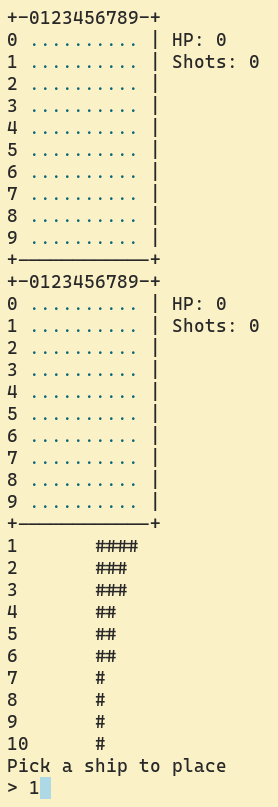
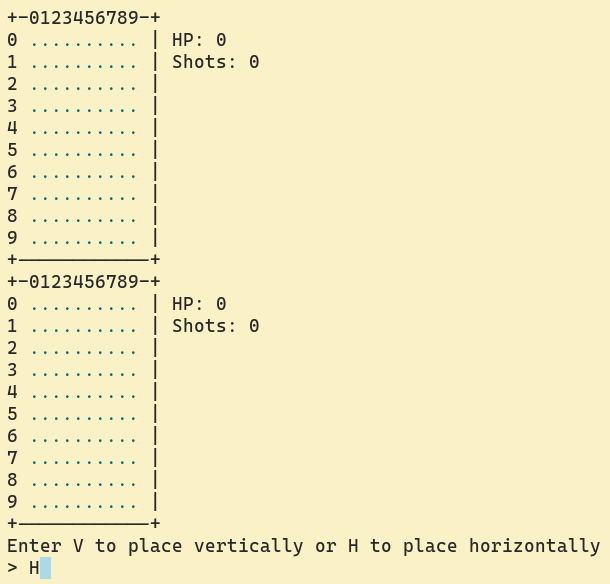
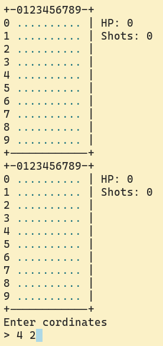
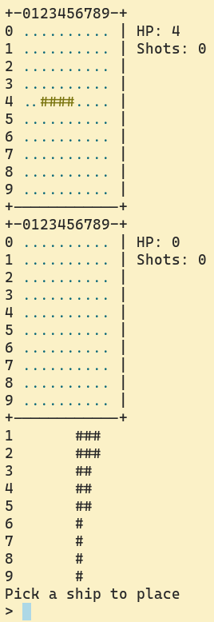
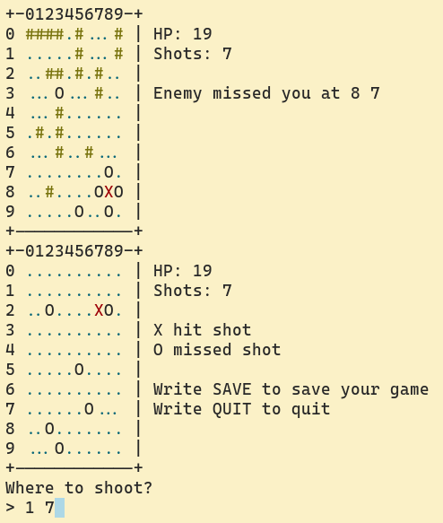
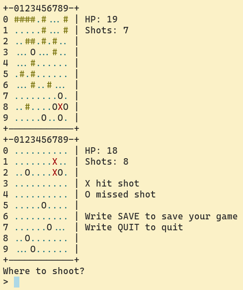
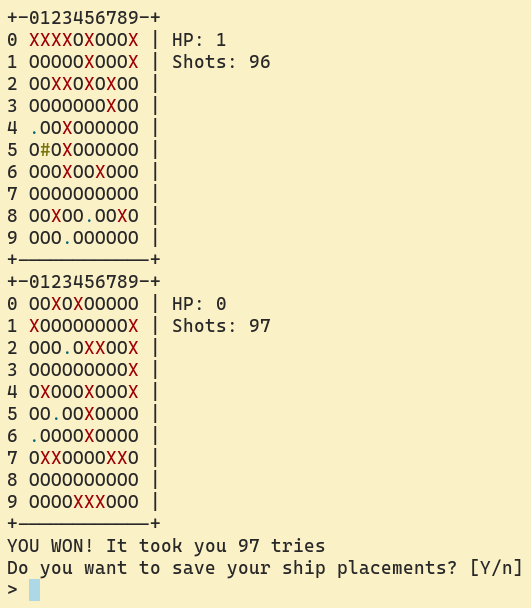

## About

Battleship is a two player game where oponents take turns trying to shoot down
eachother's ships.

In this version of the game you are playing against the computer.

## How to play

Run `main.py` with python

### Placement phase

Pick one of the numbered ships.

Choose if you want to place it vertically or horizontally.

And place it with cordinates `ROW` `COLUMN`.

### Bomb phase

Type in the cordinates where you want to shoot.
If it's a hit, you can shoot again.

You win the game when all the oponents ships have been shot down.

#### Requirements

* python 3.10

#### Optional requrements

* [termcolor](https://pypi.org/project/termcolor/) (color support)
* [tabulate](https://pypi.org/project/tabulate/) (nicer looking tables)
* [readchar](https://pypi.org/project/readchar/) (press any key when viewing replays)

### How to change language

The game looks for `language/default.json` and picks `language/english.json` if it can't find it.

To change language, either

1. Copy the language file of your choice
1. Name the copy `default.json`
1. Place the copy in the `language/` directory

or

1. Make a symlink in the directory `language/` called `default.json` pointing to your language file
